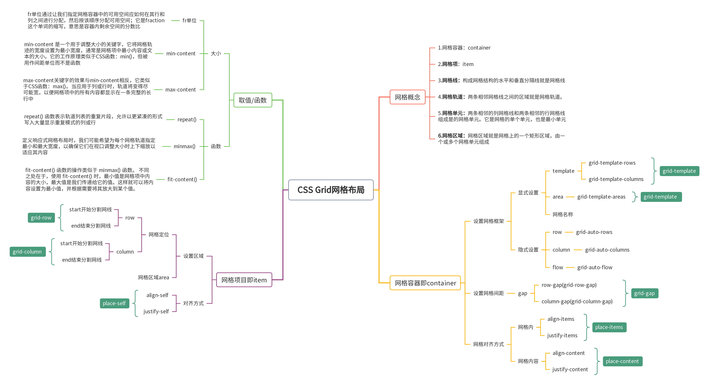
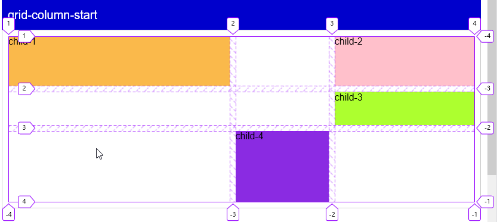
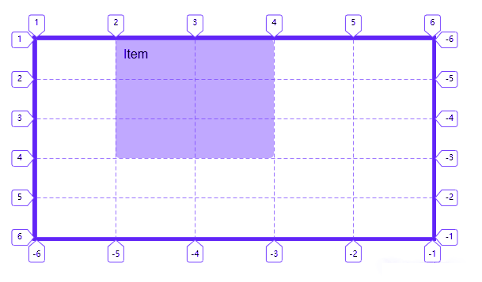
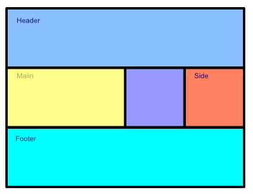
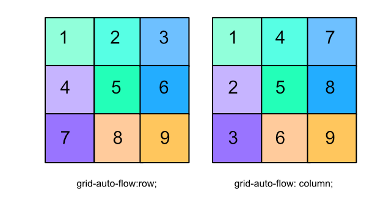
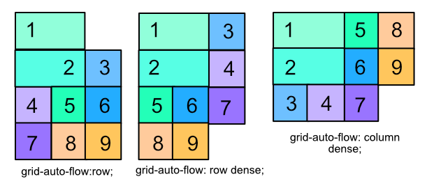
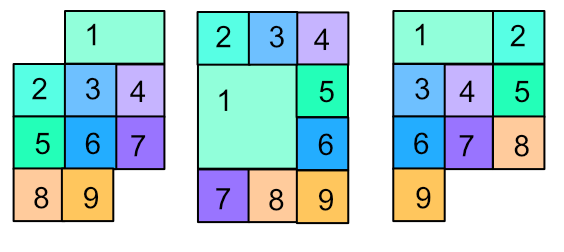

# Grid 网格布局

## CSS Grid 网格布局
Grid（网格）布局是最强大的 CSS 布局方案，与 flexbox 的一维布局系统不同，CSS Grid用于构建二维布局。Grid 布局将页面划分成一个个网格，可以任意组合不同的网格，实现各种各样的布局。通过将 CSS 规则应用于 父元素 (成为 Grid Container 网格容器)和其 子元素（成为 Grid Items 网格项），你就可以轻松使用 Grid(网格) 布局。



## Grid 重要概念

- **网格容器**（Grid Container）元素应用display:grid，它是其所有网格项的父元素。
- **网格项**（Grid Item）网格容器的直接子元素
- **网格线**（Grid Line）组成网格线的分界线。它们可以是列网格线（column grid lines），也可以是行网格线（row grid lines）并居于行或列 的任意一侧
- **网格轨道**（Grid Track）两个相邻的网格线之间为网格轨道。
- **网格单元**（Grid Cell）两个相邻的列网格线和两个相邻的行网格线组成的是网格单元，它是最小的网格单元。
- **网格区**（Grid Area）网格区是由任意数量网格单元组成


### 1.网格容器(Grid Container)
网格容器是所有网格项的父元素，即采用网格布局的区域，称为"容器"（container）,网格容器会定义display:grid。下面例子中;容器内部子元素，称为"项目"（item），即container -> item。

```html
<div class="container">
    <div class="item item_1">1</div>
    <div class="item item_2">2</div>
    <div class="item item_3">3</div>
    <div class="item item_4">4</div>
    <div class="item item_5">5</div>
    <div class="item item_6">6</div>
    <div class="item item_7">7</div>
    <div class="item item_8">8</div>
    <div class="item item_9">9</div>
</div>
```
```css
.container {
    display:grid;
    grid-template-columns: 100px 100px 100px;
    grid-template-rows: 100px 100px 100px;
    row-gap: 10px;
    column-gap: 10px;
    justify-items:center;
    align-items:center;
}
.item {
    font-size: 40px;
    color: white;
    display: inline-grid;
    width:100%;
    height:100%;
    height:-webkit-fill-available;
    justify-content:center;
    align-items:center;
}
.item_1 {
    background-color: #55efc4;
}
.item_2 {
    background-color: #81ecec;
}
.item_3 {
    background-color: #74b9ff;
}
.item_4 {
    background-color: #a29bfe;
}
.item_5 {
    background-color: #00b894;
}
.item_6 {
    background-color: #0984e3;
}
.item_7 {
    background-color: #6c5ce7;
}
.item_8 {
    background-color: #fab1a0;
}
.item_9 {
    background-color: #fdcb6e;
}

```


<div class="container">
    <div class="item item_1">1</div>
    <div class="item item_2">2</div>
    <div class="item item_3">3</div>
    <div class="item item_4">4</div>
    <div class="item item_5">5</div>
    <div class="item item_6">6</div>
    <div class="item item_7">7</div>
    <div class="item item_8">8</div>
    <div class="item item_9">9</div>
</div>

<style>
.container {
    display:grid;
    grid-template-columns: 100px 100px 100px;
    grid-template-rows: 100px 100px 100px;
    row-gap: 10px;
    column-gap: 10px;
    justify-items:center;
    align-items:center;
}
.item {
    font-size: 40px;
    color: white;
    display: inline-grid;
    width:100%;
    height:100%;
    height:-webkit-fill-available;
    justify-content:center;
    align-items:center;
}
.item_1 {
    background-color: #55efc4;
}
.item_2 {
    background-color: #81ecec;
}
.item_3 {
    background-color: #74b9ff;
}
.item_4 {
    background-color: #a29bfe;
}
.item_5 {
    background-color: #00b894;
}
.item_6 {
    background-color: #0984e3;
}
.item_7 {
    background-color: #6c5ce7;
}
.item_8 {
    background-color: #fab1a0;
}
.item_9 {
    background-color: #fdcb6e;
}
</style>


### 2. display属性
**display：grid** 为一个容器采用网格布局模式

将元素定义为网格容器，并为其内容建立新的网格格式化上下文，属性值有2个：  
**grid ：** 生成一个块级网格  
**inline-grid：**  生成一个行级网格
```css
.container {
     display: grid;
    /* display: inline-grid; 行级网格*/
}
``` 
在大多数场景下我们往往采用grid块级网格，会像块级元素一样占满一行  
对于inline-grid行级网格，它就能让容器与其他元素共占一行，容器和行内块元素基本一致
<p style="color: var(--vp-c-brand);">在大多数场景下我们往往采用grid块级网格，会像块级元素一样占满一行</p>


### 3.网格轨道
grid-template-columns属性：定义每一列的列宽  
grid-template-rows 属性：定义每一行的行高

```css
**语法** 
grid-template-columns<rows>: length | percent | auto | fr
```
```css
.container {
    display: grid;
    grid-template-columns: 100px 100px 100px;
    grid-template-rows: 100px 100px 100px;
}
//在上面的代码中划分了一个三行三列，列宽和行高都是200px的网格
```
**1. repeat()**  
> 当我们需要写很多行很多列的时候，一个个敲相同的值会非常麻烦，这时候就可以使用repeat()函数，简化重复值  
> repeat()接受两个参数，第一个参数是重复的次数，第二个参数是所要重复的值

该函数有两个参数：  
① 第一个参数用来指定行或列的重复模式重复的次数，有三种取值方式：  
**number**：整数，确切的重复次数。   
**auto-fill**：以网格项为准自动填充。   
**auto-fit**：以网格容器为准自动填充。   

② 第二个参数用来指定行或列的重复模式重复的内容，有以下取值方式：   
**length**：非负长度。   
**percentage**：相对于列轨道中网格容器的内联大小的非负百分比，以及行轨道中网格容器的块长宽。  
**flex**：单位为fr的非负长度，指定轨道弹性布局的系数值。   
max-content：表示网格的轨道长度自适应内容最大的那个单元格。   
min-content：表示网格的轨道长度自适应内容最小的那个单元格。   
auto：作为最大值时，等价于max-content。作为最小值时，它表示轨道中单元格最小长宽(min-width/min-height)的最大值。  

```css
.container {
    display: grid;
    grid-template-columns: repeat(3,100px);
    grid-template-rows: repeat(3,100px);
  }
/*不止于此，repeat还可以重复某种模式，就像*/
    grid-template-columns: repeat(3,200px 100px);
/*这句代码定义了6列，分别是200，100，200，100，200，100*/
```
**2 .auto-fill关键字**  
表示自动填充，让一行（或者一列）中尽可能的容纳更多的单元格
> 当我们只需要确定列宽或者行高，而不用理有多少列时，就可以使用它了
```css
.container {
    display: grid;
    grid-template-columns: repeat(auto-fill,100px);
    grid-template-rows: repeat(3,100px);
}
/**每一列200px，列数设置为了auto-fill会自动填充，此时缩小浏览器的宽度，
项目会因填充不下而另起一行 */
```

**3. fr关键字**    
fr 单位代表网格容器中可用空间的一等份。

```css
.container {
    display: grid;
    grid-template-columns: 100px 1fr 2fr ;
    grid-template-rows: repeat(3,100px)
}
/*表示第一个列宽设置为 200px，后面剩余的宽度分为两部分，第二给项目占1/3，第三个项目占2/3 */
```

**4. minmax()**    
minmax() 函数产生一个长度范围，表示长度就在这个范围之中都可以应用到网格项目中。它接受两个参数，分别为最小值和最大值 
```css
grid-template-columns: 200px 1fr minmax(400px,1fr);
grid-template-rows: repeat(3,100px)
```
**5.auto关键字**  
设置auto后，将由浏览器自行决定长度，尽可能的会占满剩余空间，除非有其他设置，例如有min-width之类的，利用这个关键字，我们可以轻易实现三列或者两列布局。

```css
grid-template-columns: 100px auto 100px;
grid-template-rows: repeat(3,100px)
```
**6.网格线**    
使用Grid布局在显式网格中定义轨道的同时会创建网格线。网格线有水平和垂网格线。也就是东西路段和南北路段的马路。正常情况下n行会有n+1根横向网格线，m列有m+1根纵向网格线。比如田字就好像是一个三条水平线和三条垂直线构成的网格元素;
grid布局叫做网格布局，那自然少不了网格线的存在，使用方括号，指定每一根网格线的名字，方便以后的做定位时使用
```
grid-template-columns: [c1] 100px [c2] auto [c3] 100px [c4];
grid-template-rows:  [r1] 100px [r2] auto [r3] 100px [r4];
```


>请注意，一条网格线(Grid Line)可以有多个名称。即一个单元格结束分隔线也是第二个单元格的开始分隔线

+ 定位属性：`grid-column-start`、`grid-column-end`、`grid-row-start`、`grid-row-end` 以及对应的简写属性 `grid-column` 和 `grid-row`

***7.网格线定位***  
在网格中定位一个项目时，需要先设置它从哪根线开始，到哪儿根线结束。举个例子，我要在一个 5x5 的网格中定位一个项目，让它占据第二列和第三列，第一行到第三行。我会使用下面的 CSS 代码（注意，这里使用的是网格线，而非网格轨道）。
```css
  .item {
    grid-column-start: 2;
    grid-column-end: 4;
    grid-row-start: 1;
    grid-row-end: 4;
  }
```
上面的代码还可以简写为以下形式：斜线之前表示起始线（start line），斜线之后表示终止线（end line）

```css
  .item {
    grid-column: 2 / 4;
    grid-row: 1 / 4;
  }
```

注意，虽然 .item 的内容很少，但还是占满了整个定位区域。这是因为项目上的对齐属性 `align-self` 和 `justify-self` 的默认值为 stretch。

如果项目只需跨越一个轨道，那么可以忽略设置终止线，因为项目默认就跨域一个轨道。举个例子，设置一个只占据第二列的项目。之前会这么写：
```css
.item {
  grid-column: 2 / 3;
}

/**简写 */
.item {
  grid-column: 2;
}
```
在一个网格容器中，使用 `grid-template-columns` 或 `grid-template-rows` 设置的那部分网格区域称为 显式网格。在定义显式区域的同时，还会定义网格线。
这些网格线会编号，起始值是 1，在行内和块方向两个维度上编号。对水平书写模式、从左向右排版的语言来说：行内方向（inline direction）的编号从左开始；块方向（block direction）的编号则从上面开始。

**8.网格间距**   
`row-gap`属性设置行与行的间隔（行间距），`column-gap`属性设置列与列的间隔（列间距）。
::: tip
注意：这个属性将删除 grid- 前缀，就是将 grid-gap 重命名为 gap。 Chrome 68+，Safari 11.2 Release 50+ 和Opera 54+ 已经支持无前缀的属性.

> grid-row-gap 属性、grid-column-gap 属性分别设置行间距和列间距。grid-gap 属性是两者的简写形式。  
> 注意：这两个属性将删除 grid- 前缀，就是将 grid-column-gap 和 grid-row-gap重命名为 column-gap和 row-gap。  > Chrome 68+，Safari 11.2 Release 50+ 和Opera 54+ 已经支持无前缀的属性。

:::


```css
.container {
  grid-template-columns: repeat(3,100px);
  grid-template-rows: repeat(3,100px);
  row-gap: 10px;
  column-gap: 10px;
}

```
在这段代码中定义了行间距为10px，列间距为10px，也可以采用合并属性gap来写gap: 10px 10px的意思和上面相同，第一个参数是行间距，第二个是列间距

**9.单元格内容排列方式**   
justify-items 属性设置单元格内容的水平位置（左中右），align-items 属性设置单元格的垂直位置（上中下）
这里只以justify-items做展示，另一个类似
+ `start`：对齐单元格的起始边缘。
+ `end`：对齐单元格的结束边缘。
+ `center`：单元格内部居中。
+ `stretch`：拉伸，占满单元格的整个宽度（默认值）。
```css
.container {
    display: grid;
    grid-template-columns: 100px 100px 100px;
    grid-template-rows: 100px 100px 100px;
    gap: 10px 10px;
    justify-items: center;
}
```
对于justify-items 和align-items 属性，可以采用合并的写法
```css
place-items: start end;
```
代表的意思是垂直方向子项对齐起始位置，水平方向对齐结束位置  
::: tip

注意：如果只写一个值，默认第二个值与第一个相等  

:::

***10. 内容区域的排列方式**  
justify-content属性是定义整个内容区域在容器里面的水平位置（左中右），align-content属性是定义整个内容区域的垂直位置（上中下）
有以下几个属性
+ `start` ：对齐容器的起始边框。
+ `end` ：对齐容器的结束边框。
+ `center` ：容器内部居中
+ `stretch` ：项目大小没有指定时，拉伸占据整个网格容器。
+ `space-around` ：每个项目两侧的间隔相等。因此，项目之间的间隔比项目与容器边框的间隔大一倍
+ `space-between` ：项目与项目的间隔相等，项目与容器边框之间没有间隔。
+ `space-evenly` ：项目与项目的间隔相等，项目与容器边框之间也是同样长度的间隔。

```css
justify-content: start;
/*justify-content: center;
justify-content: end;*/
```

**11 .grid-template-areas** 
网格布局允许指定"区域"（area），一个区域由单个或多个单元格组成。 grid-template-areas 属性用于定义区域;重复网格区域的名称导致内容跨越这些单元格。一个点号（.）代表一个空单元格。这个语法本身可视作网格的可视化结构。
```css

.container {
  grid-template-areas: 
    "<grid-area-name> | . | none | ..."
    "...";
  }
  /**
  <grid-area-name>：由网格项的 grid-area 指定的网格区域名称
    .（点号） ：代表一个空的网格单元
    none：不定义网格区域
  */

.main {
    display: grid;
    grid-template-columns: 100px 100px 100px;
    grid-template-rows: 100px 100px 100px;
    grid-template-areas: 'a b c'
                         'd e f'
                         'g h i';
}

/**示例 */
.container{
    grid-template-areas: "header header header header"
                         "main main . sidebar"
                         "footer footer footer footer";
}

```


**12grid-auto-flow 排列属性**  
划分网格以后，容器的子元素会按照顺序，自动放置在每一个网格。默认的放置顺序是"先行后列"，即先填满第一行，再开始放入第二行，默认即下图数字的顺序。
这个顺序由grid-auto-flow属性决定，默认值是row，即"先行后列"。也可以将它设成column，变成"先列后行"。
```css
grid-auto-flow: column;
```


grid-auto-flow属性除了设置成row和column，还可以设成row dense和column dense。这两个值主要用于，某些项目指定位置以后，剩下的项目怎么自动放置。

```css
grid-auto-flow: row dense;
/*grid-auto-flow: column dense;*/
```

- 现在修改设置，设为row dense，表示"先行后列"，并且尽可能紧密填满，尽量不出现空格。(图二)  
- 如果将设置改为column dense，表示"先列后行"，并且尽量填满空格。(图三)


**13.fit-content()**  
`fit-content()` 函数的操作类似于 `minmax()` 函数。 不同之处在于，使用 `fit-content()` 时，最小值是网格项中内容的大小，最大值是我们传递给它的值。这样就可以将内容设置为最小值，并根据需要将其放大到某个值。
当应用于网格轨道时，它将网格轨道的大小设置为最小宽度，这是其网格项目中最小的内容或文本的大小。需要注意的是，最小的内容或文本大小不大于函数中指定的值。
但是，如果最小宽度的值超过了提供给函数的值，则网格轨道的大小将设置为传递给 `fit-content()` 函数的值，并且网格项的内容将换行。

```css
.container {
   display: grid;
   grid-template-columns: fit-content(200px) fit-content(300px) fit-content(400px);
}
```
上面的代码使用 fit-content() 函数分别创建了宽度为 200px、300px 和 400px 的三列。 这意味着每列的大小将等于其网格项目中最小的内容或文本的大小，但如果这变得大于提供给 fit-content() 函数的值，则列将设置为传递给 fit-content() 函数的值。


### 4. 项目属性
项目的位置是可以指定的，具体方法就是指定项目的四个边框，分别定位在哪根网格线。
* grid-column-start属性：左边框所在的垂直网格线
* grid-column-end属性：右边框所在的垂直网格线
* grid-row-start属性：上边框所在的水平网格线
* grid-row-end属性：下边框所在的水平网格线
```css
.item-1 {
  grid-column-start: 2;
  grid-column-end: 4;
}
```
上面代码指定，1号项目的左边框是第二根垂直网格线，右边框是第四根垂直网格线(注:可简单理解为：左边框从第2个grid网格开始，右边框与第个grid网格结束）。

::: tip

注意：除了指定项目以外，其他项目都没有指定位置，由浏览器自动布局，这时它们的位置由容器的grid-auto-flow属性决定，这个属性的默认值是row，因此会"先行后列"进行排列。读者可以把这个属性的值分别改成column、row dense和column dense，


:::

这四个属性的值，除了指定为第几个网格线，还可以指定为网格线的名字。

```css
.item-1 {
  grid-column-start: header-start;
  grid-column-end: header-end;
}
```
上面代码中，左边框和右边框的位置，都指定为网格线的名字。

这四个属性的值还可以使用span关键字，表示"跨越"，即左右边框（上下边框）之间跨越多少个网格。
```css
.item-1 {
  grid-column-start: span 2;
}
```


::: tip

**grid-row，gird-column**  
- **grid-column** 属性是 grid-column-start 和 grid-column-end 的合并简写形式;  
- **grid-row**  属性是 grid-row-start 属性和 grid-row-end 的合并简写形式
:::

```css
/*语法格式：s*/
grid-column: <start-line>/ <end-line>;
grid-row: <start-line>/ <end-line>;

/**示例 */
.item-1 {
    grid-column: 1 / 3;
    grid-row: 1 / 2;
}

/* 等同于 */
.item-1 {
    grid-column-start: 1;
    grid-column-end: 3;
    grid-row-start: 1;
    grid-row-end: 2;
}
``` 

**2.justify-self，align-self**
**justify-self**  属性设置单元格内容的水平位置（左中右），跟 **justify-items** 属性的用法完全一致，但只作用于单个项目  
**align-self** 属性设置单元格内容的垂直位置（上中下），跟 **align-items** 属性的用法完全一致，也是只作用于单个项目
```css
justify-self: start | end | center | stretch;
align-self: start | end | center | stretch;

属性值：start | end | center | stretch 具体的意思如下：
start：对齐单元格的起始边缘
end：对齐单元格的结束边缘
center：单元格内部居中
stretch：拉伸，占满单元格的整个宽度（默认值）

```
::: tip

**place-self**  
place-self 属性是 align-self 属性和 justify-self 属性的合并简写形式。  
如果省略第二个值， place-self 属性会认为这两个值相等
:::
```css
/**语法格式 */
place-self: <align-self><justify-self>;
```
::: tip
grid布局中属性有很多，可以要通过实战来记这些属性，要区分好容器属性，至于项目布局没有必要执着于grid网格布局即可！
:::


